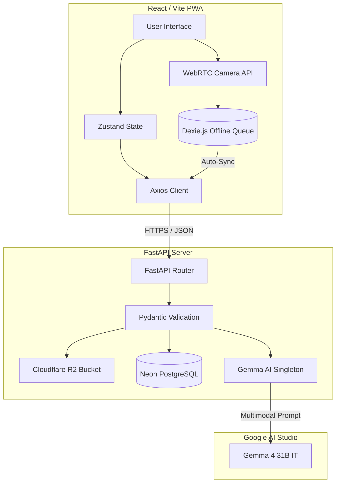

<!-- shields.io badges -->
<div align="center">


</div>

# 🧠 CareVision: Multimodal AI Clinical Decision-Support PWA

> **One-liner:** A privacy-first, offline-capable Progressive Web App (PWA) powered by Google's Gemma 4 (31B) to provide clinical decision support and rapid diagnostic test (RDT) interpretation for community health workers in low-resource environments.

---

## 📌 Problem Statement

Community health workers (CHWs) operating in "last-mile" clinics and remote geographies frequently face complex clinical scenarios without immediate access to specialist medical advice. Existing digital health tools often rely on continuous, high-bandwidth internet connectivity, which is structurally absent in these regions. 

**CareVision** bridges this critical gap by delivering a mobile-first, fully offline-capable clinical decision support system. By integrating the advanced multimodal capabilities of the Gemma 4 AI pipeline with an intelligent offline-sync queue, CareVision allows CHWs to interpret diagnostic tests, identify medications, and consult WHO protocols seamlessly, ensuring that patient care is never gated by network instability.

---

## ✨ Key Features & Clinical Capabilities

- 🎯 **TestStrip (RDT Interpretation)** — Automates the reading of rapid diagnostic tests (malaria, HIV, TB, pregnancy) with high-confidence validation, minimizing human error in faint line detection.
- 💊 **MedScan** — Extracts drug names and dosages from blurry or damaged packaging to prevent critical administration and dispensing errors.
- 🩹 **WoundAssess** — Performs multimodal assessment of physical injuries, automatically assigning a 5-level severity score to trigger escalation and referral workflows.
- 📄 **DocReader** — Extracts structured clinical data from unstructured documents, including handwritten lab reports, prescriptions, and vaccination records.
- 🤖 **Protocol Assistant** — An interactive, context-aware Q&A agent grounded strictly in WHO clinical guidelines (Operating at a strict temperature of `0.2` to ensure factual consistency).
- 📶 **Robust Offline-First Architecture** — Powered by `Dexie.js` (IndexedDB), the app queues analysis requests locally when offline, implementing an exponential 3-retry background sync strategy once connectivity is restored.

---

## 🏗️ System Architecture

The system is designed with a strict separation of concerns, utilizing an asynchronous FastAPI backend and a strictly-typed React frontend, completely abstracted from the underlying LLM infrastructure.



### Component Stack

| Layer | Technology | Rationale / Purpose |
|---|---|---|
| **Frontend UI** | React 18, Vite, TypeScript | Chosen for rendering performance and strict typings. |
| **Offline Layer** | `vite-plugin-pwa`, `Dexie.js` | IndexedDB is required over LocalStorage to handle large base64 image blobs. |
| **Backend Core** | FastAPI (Python 3.12) | High-performance async routing and native data validation. |
| **Validation** | Pydantic V2 | Enforces strict API contracts and payload sanitization. |
| **Database** | Neon PostgreSQL, SQLAlchemy 2 | Serverless scaling with async pg drivers (`asyncpg`). |
| **AI Engine** | Gemma 4 (31B) via Google AI | Multimodal visual capabilities; constrained via strict prompt engineering. |
| **Blob Storage** | Cloudflare R2 | S3-compatible, zero-egress cost storage for clinical encounter images. |

---

## 🚨 Current Project Status & Technical Blockers

> **Current Phase:** Phase 1 (Foundation) has been built. The application is currently **NOT in a working state** due to specific integration and environment blockers.

As of the latest development sprint, the scaffolding exists but end-to-end communication is failing. The following blockers must be resolved before proceeding to Phase 4 (Deployment):

### 1. Python Environment & Dependency Conflicts (`externally-managed-environment`)
- **The Issue:** Attempting to run `pip install -r requirements.txt` directly on the host machine fails due to PEP 668 constraints enforced by modern Linux distributions. Consequently, dependencies like FastAPI are not installed in the active path, throwing `ModuleNotFoundError`.
- **Resolution Path:** A strictly isolated virtual environment (`python -m venv venv` or a dedicated `conda` environment) must be initialized, activated, and used exclusively for the backend.

### 2. API Contract Mismatches (HTTP 422 Unprocessable Entity)
- **The Issue:** The FastAPI backend relies on strict Pydantic schemas (`AnalyzeRequest`). The React frontend is currently dispatching Axios requests with a payload structure that does not map perfectly to the backend expectations.
- **Resolution Path:** Refactor the frontend `AnalysisRequest` interface. Ensure that `image_b64` (string), `type` (AnalysisType enum), and `consent_given` (boolean) are correctly serialized and transmitted. Image inference will persistently fail until this schema parity is achieved.

### 3. Protocol Assistant API Routing Failures
- **The Issue:** The Protocol Assistant feature is experiencing fatal communication errors. The frontend-to-backend request payload for clinical protocol queries is malformed or hitting an unhandled route configuration, preventing the `GemmaClient` from receiving the query.
- **Resolution Path:** Conduct a trace on the `/api/protocols` endpoint. Align the Pydantic schema for protocol requests with the frontend Axios dispatch structure.

### 4. Sandbox Permission Errors in Development Automation
- **The Issue:** AI development agents running inside isolated sandboxes (like `nsjail`) are encountering `Permission denied` errors (e.g., `rm: cannot remove '/tmp/antigravity-nsjail-sandbox.../deny0'`) when attempting to execute terminal commands such as `npm install` or `git push`.
- **Resolution Path:** Developers must manually execute package management (`npm install`, `npm run dev`) and Git operations (`git commit`, `git push`) on their local host machines outside of the agentic sandbox.

---

## 🚀 Quick Start (Local Development)

### Prerequisites
- **Python:** 3.12+
- **Node.js:** 18.x+
- **Database:** PostgreSQL URL (e.g., Neon free tier)
- **AI Access:** Google AI Studio API Key
- **Storage:** Cloudflare R2 Token

### Backend Setup

```bash
# 1. Navigate to backend and setup isolation
cd carevision/backend
python -m venv venv
source venv/bin/activate  # Linux/macOS
# venv\Scripts\activate   # Windows

# 2. Install dependencies
pip install -r requirements.txt

# 3. Environment configuration
cp .env.example .env
# [!] Manually edit .env to include GEMMA_API_KEY and DATABASE_URL

# 4. Initialize Database
alembic upgrade head

# 5. Launch the Server
uvicorn app.main:app --reload --port 8000
```

### Frontend Setup

```bash
# 1. Navigate to frontend
cd carevision/frontend

# 2. Install node modules (Manually on host machine)
npm install

# 3. Environment configuration
cp .env.example .env

# 4. Launch Vite Dev Server
npm run dev
```

---

## 📂 Repository Structure

```text
carevision/
├── backend/                        # FastAPI Service
│   ├── app/
│   │   ├── db/                     # SQLAlchemy models and Alembic migrations
│   │   ├── prompts/                # Strict system prompts for Gemma 4
│   │   ├── routes/                 # FastAPI controllers
│   │   ├── schemas/                # Pydantic V2 definitions
│   │   └── services/               # Core business logic (GemmaClient, R2)
│   ├── tests/                      # Pytest verification suite
│   └── requirements.txt            # Pinned Python dependencies
│
├── frontend/                       # React + Vite PWA
│   ├── src/
│   │   ├── api/                    # Axios instances and endpoint definitions
│   │   ├── components/             # Reusable UI (Camera, ResultCard)
│   │   ├── pages/                  # Route views (Home, TestStrip, etc.)
│   │   ├── store/                  # Zustand state & Dexie.js offline queue
│   └── package.json                # NPM configuration
│
├── docker-compose.yml              # Local container orchestration
└── README.md                       # Project documentation
```

---

## 🔒 Security & Compliance

- **No Secrets in Source:** Under no circumstances should API keys, database URLs, or tokens be committed. `detect-secrets` should be run prior to pushing.
- **Data Privacy:** Image payloads are strictly gated behind the `consent_given` flag. If consent is `false`, the image is processed transiently in memory and immediately discarded.
- **Clinical Disclaimer:** A mandatory legal and clinical disclaimer is hard-injected server-side into every AI response via the `schemas/common.py` constant.

---

## 🤝 Contributing

Contributions must follow the guidelines outlined in our publishing standards.
1. Branch from `main` using `feat/your-feature`.
2. Follow **Conventional Commits** (e.g., `feat(api): align Pydantic schema with frontend payload`).
3. Ensure the local test suite passes (`pytest` and `tsc --noEmit`).
4. Submit a Pull Request for review.

---

## 📜 License & Acknowledgements

- This project is licensed under the **Apache 2.0 License** — see the `LICENSE` file for details.
- Developed as a submission for the **Kaggle Gemma 4 Good** hackathon.
- UI/UX inspired by field guidelines from global health organizations.