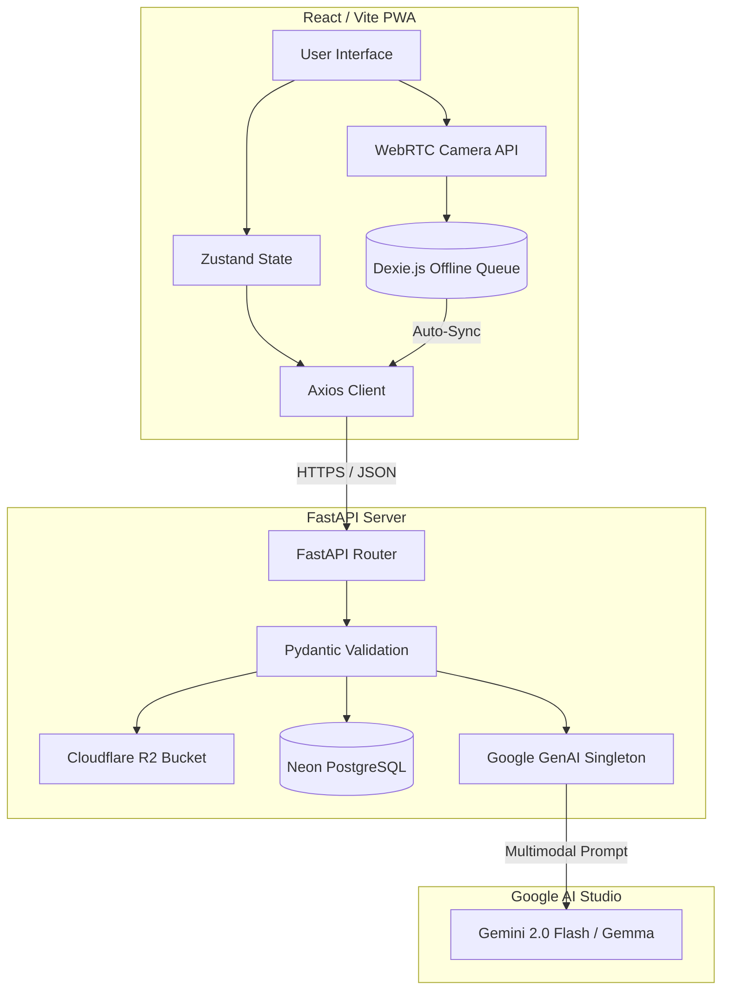

<!-- shields.io badges -->
<div align="center">


</div>

# 🧠 CareVision: Multimodal AI Clinical Decision-Support PWA

> **One-liner:** A privacy-first, offline-capable Progressive Web App (PWA) powered by Google's native multimodal AI (Gemini/Gemma) to provide clinical decision support and rapid diagnostic test (RDT) interpretation for community health workers in low-resource environments.

---

## 📌 Problem Statement

Community health workers (CHWs) operating in "last-mile" clinics and remote geographies frequently face complex clinical scenarios without immediate access to specialist medical advice. Existing digital health tools often rely on continuous, high-bandwidth internet connectivity, which is structurally absent in these regions. 

**CareVision** bridges this critical gap by delivering a mobile-first, fully offline-capable clinical decision support system. By integrating the advanced multimodal capabilities of the Google Generative AI pipeline with an intelligent offline-sync queue, CareVision allows CHWs to interpret diagnostic tests, identify medications, and consult WHO protocols seamlessly, ensuring that patient care is never gated by network instability.

---

## ✨ Key Features & Clinical Capabilities

- 🎯 **TestStrip (RDT Interpretation)** — Automates the reading of rapid diagnostic tests (malaria, HIV, TB, pregnancy) with high-confidence validation, minimizing human error in faint line detection.
- 💊 **MedScan** — Extracts drug names and dosages from blurry or damaged packaging to prevent critical administration and dispensing errors.
- 🩹 **WoundAssess** — Performs multimodal assessment of physical injuries, automatically assigning a 5-level severity score to trigger escalation and referral workflows.
- 📄 **DocReader** — Extracts structured clinical data from unstructured documents, including handwritten lab reports, prescriptions, and vaccination records.
- 🤖 **Protocol Assistant** — An interactive, context-aware Q&A agent grounded strictly in WHO clinical guidelines (Operating at a strict temperature of `0.2` to ensure factual consistency).
- 📶 **Robust Offline-First Architecture** — Powered by `Dexie.js` (IndexedDB), the app queues analysis requests locally when offline, implementing an exponential 3-retry background sync strategy once connectivity is restored.

---

## 🏗️ Architecture Overview

The system is designed with a strict separation of concerns, utilizing an asynchronous FastAPI backend and a strictly-typed React frontend, completely abstracted from the underlying LLM infrastructure.



| Component        | Technology          | Purpose                          |
|------------------|---------------------|----------------------------------|
| **Frontend UI**  | React 18, Vite      | Chosen for rendering performance and strict typings. |
| **Offline Layer**| `Dexie.js`          | IndexedDB is required over LocalStorage to handle large base64 image blobs natively. |
| **Backend Core** | FastAPI (Python)    | High-performance async routing and native data validation. |
| **Validation**   | Pydantic V2         | Enforces strict API contracts and payload sanitization. |
| **Database**     | Neon PostgreSQL     | Serverless scaling with async pg drivers (`asyncpg`). |
| **AI Engine**    | Google GenAI SDK    | Multimodal visual capabilities; constrained via strict function calling & prompt engineering. |
| **Blob Storage** | Cloudflare R2       | S3-compatible, zero-egress cost storage for clinical encounter images. |

---

## 🚀 Quick Start (Local Development)

### Prerequisites

- **Python:** 3.12+
- **Node.js:** 18.x+
- **Database:** PostgreSQL URL (e.g., Neon free tier)
- **AI Access:** Google AI Studio API Key (`AIzaSy...`)
- **Storage:** Cloudflare R2 Token

### Backend Setup

```bash
# 1. Navigate to backend and setup isolation
cd carevision/backend
python -m venv venv
source venv/bin/activate  # Linux/macOS
# venv\Scripts\activate   # Windows

# 2. Install dependencies
pip install -r requirements.txt

# 3. Environment configuration
cp .env.example .env
# Edit .env to include your Google GEMMA_API_KEY and DATABASE_URL

# 4. Initialize Database
alembic upgrade head

# 5. Launch the Server
uvicorn app.main:app --reload --port 8000
```

### Frontend Setup

```bash
# 1. Navigate to frontend
cd carevision/frontend

# 2. Install node modules
npm install

# 3. Environment configuration
cp .env.example .env

# 4. Launch Vite Dev Server
npm run dev
```

---

## 📂 Project Structure

```text
carevision/
├── backend/                        # FastAPI Service
│   ├── app/
│   │   ├── db/                     # SQLAlchemy models and Alembic migrations
│   │   ├── prompts/                # Strict system prompts for clinical evaluation
│   │   ├── routes/                 # FastAPI controllers
│   │   ├── schemas/                # Pydantic V2 definitions
│   │   └── services/               # Core business logic (GenAI Client, R2)
│   ├── tests/                      # Pytest verification suite
│   └── requirements.txt            # Pinned Python dependencies
│
├── frontend/                       # React + Vite PWA
│   ├── src/
│   │   ├── api/                    # Axios instances and endpoint definitions
│   │   ├── components/             # Reusable UI (Camera, ResultCard)
│   │   ├── pages/                  # Route views (Home, TestStrip, etc.)
│   │   └── store/                  # Zustand state & Dexie.js offline queue
│   └── package.json                # NPM configuration
│
├── docker-compose.yml              # Local container orchestration
└── README.md                       # Project documentation
```

---

## 🔒 Security & Compliance

- **No Secrets in Source:** Under no circumstances should API keys, database URLs, or tokens be committed. Run `detect-secrets` prior to pushing.
- **Data Privacy:** Image payloads are strictly gated behind the `consent_given` flag. If consent is `false`, the image is processed transiently in memory and immediately discarded.
- **Clinical Disclaimer:** A mandatory legal and clinical disclaimer is hard-injected server-side into every AI response via the `schemas/common.py` constant.

---

## 🤝 Contributing

Contributions are welcome and must follow the guidelines outlined in our publishing standards:
1. Branch from `main` using `feat/your-feature-name`.
2. Follow **Conventional Commits** (e.g., `feat(api): align Pydantic schema with frontend payload`).
3. Ensure the local test suite passes (`pytest` and `tsc --noEmit`).
4. Submit a Pull Request against `main` for review.

---

## 📜 License & Acknowledgements

- This project is licensed under the **Apache 2.0 License** — see the `LICENSE` file for details.
- Developed as a submission for the **Kaggle Gemma 4 Good** hackathon.
- UI/UX inspired by field guidelines from global health organizations.